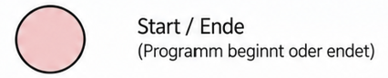
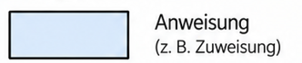
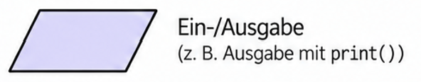
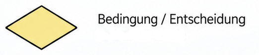
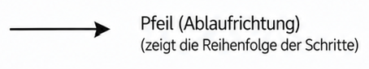
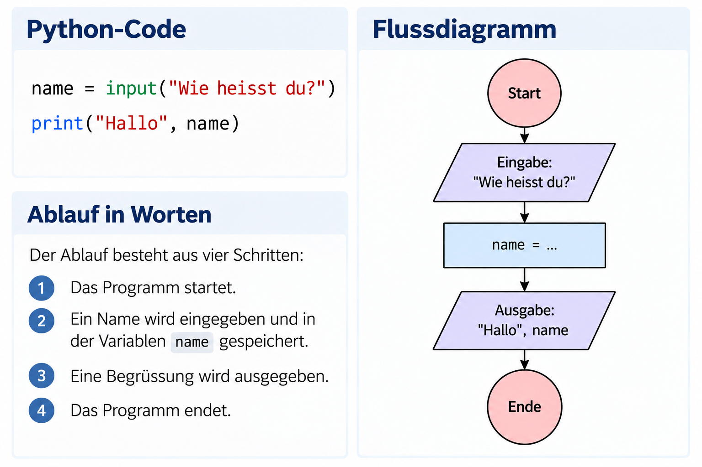
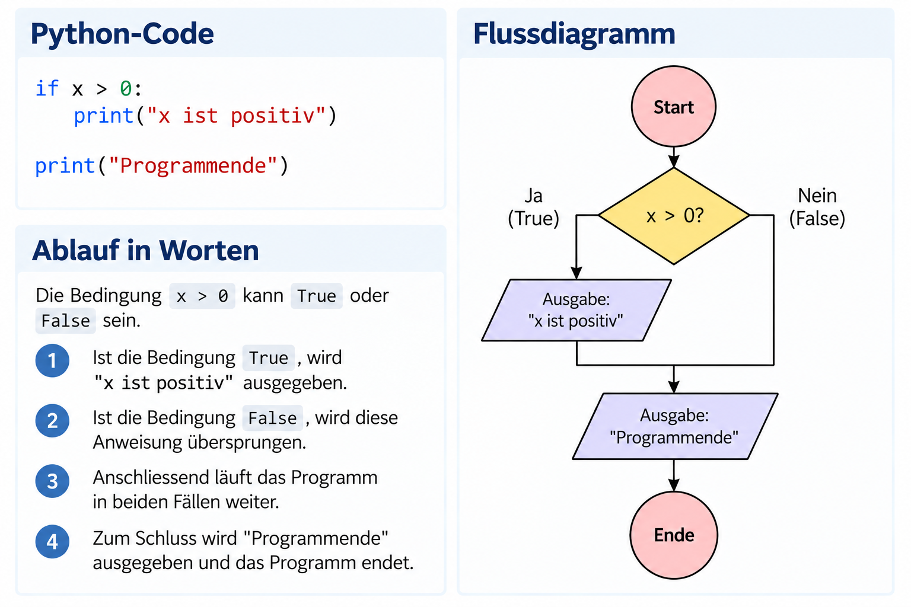
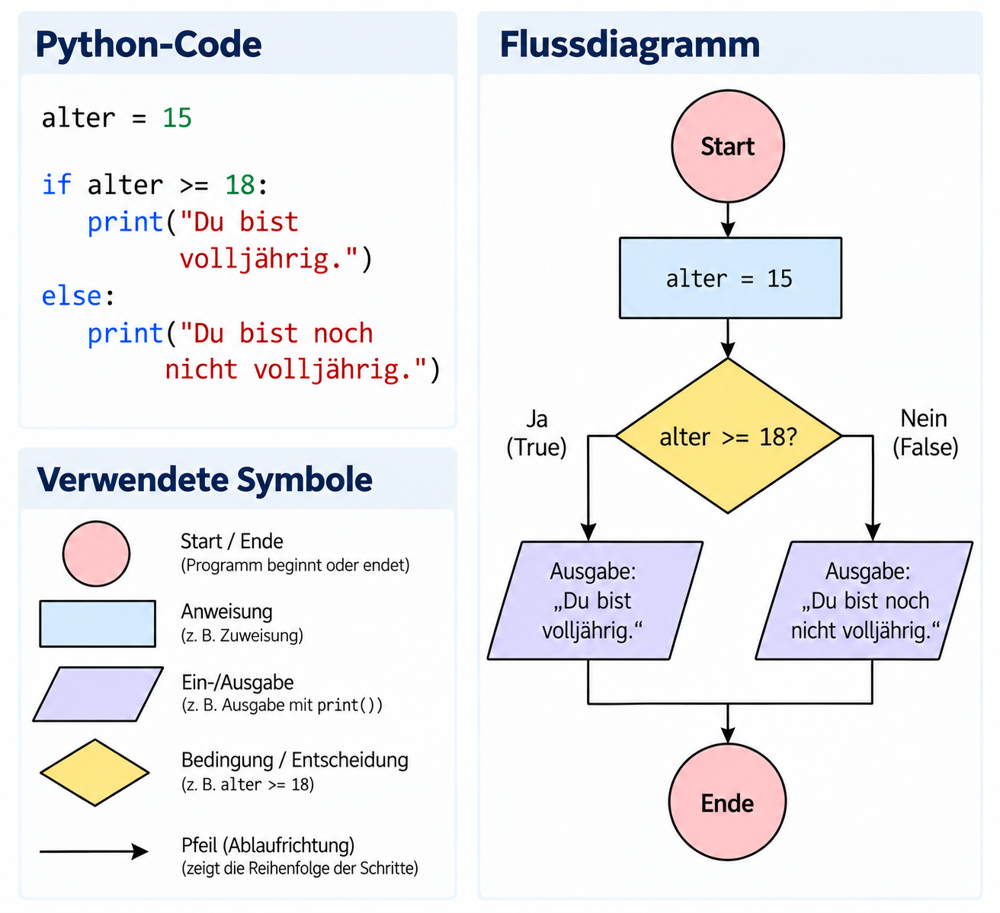
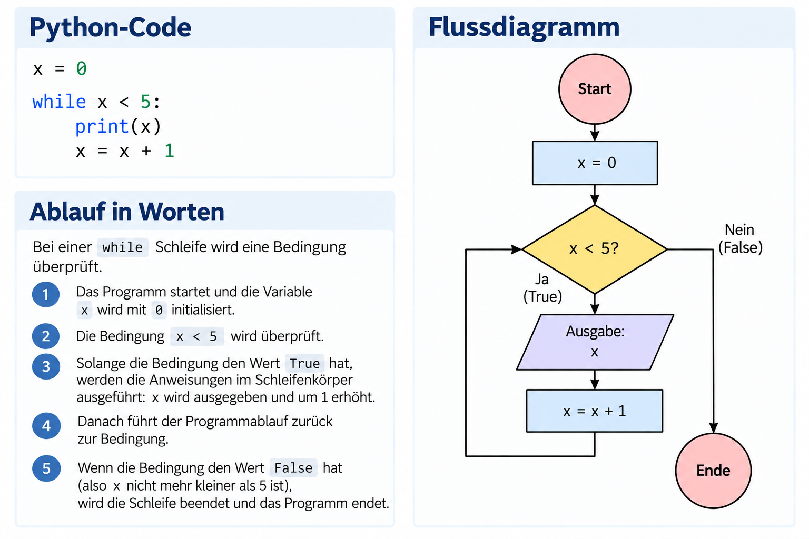
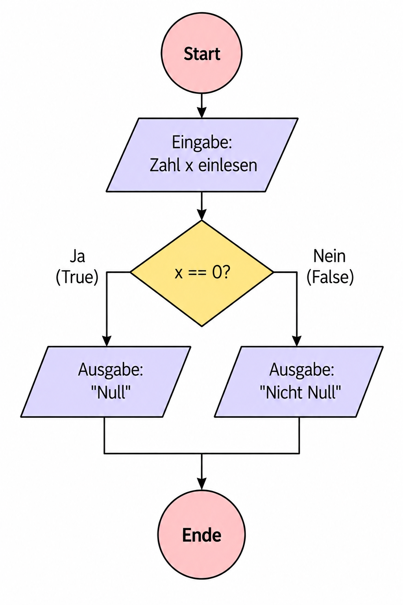

# Flussdiagramme

Ein Programm besteht aus Anweisungen, die in einer bestimmten
Reihenfolge ausgeführt werden. Mit einem **Flussdiagramm** kann dieser
Programmablauf grafisch dargestellt werden.

Flussdiagramme helfen dabei, den Ablauf eines Programms zu verstehen und
zu planen, bevor der eigentliche Python-Code geschrieben wird. Besonders
hilfreich sind sie bei **Verzweigungen** und **Schleifen**, weil dort
der Programmablauf nicht mehr nur geradlinig von oben nach unten
verläuft.

## 1. Grundelemente eines Flussdiagramms

Für die Darstellung werden verschiedene Symbole verwendet.

| Symbol | Bedeutung | Beispiel | Zeichen |
|---|---|---|---|
| Oval | Start oder Ende | Start | [](assets/images/start_ende.png)|
| Rechteck | Anweisung | `x = x + 1` | [](assets/images/anweisung.png)|
| Parallelogramm | Ein- oder Ausgabe | `input()` / `print()` | [](assets/images/input_output.png)|
| Raute | Bedingung bzw. Entscheidung/Verzweigung | `x > 0` | [](assets/images/Bedingung.png)|
| Pfeil | Richtung des Programmablaufs | nächster Schritt | [](assets/images/Pfeil.png)|

Die Symbole werden mit **Pfeilen** verbunden. Dadurch wird sichtbar, in
welcher Reihenfolge die einzelnen Schritte ausgeführt werden.

!!! note "Merke" Ein Flussdiagramm stellt nicht den Python-Code selbst
dar, sondern den **Ablauf des Programms**.

## 2. Ein einfacher Programmablauf

Betrachten wir folgendes Programm:

``` python
name = input("Wie heisst du?")
print("Hallo", name)
```

Der Ablauf besteht aus drei Schritten:

1.  Das Programm startet.
2.  Ein Name wird eingegeben und in der Variablen `name` gespeichert.
3.  Eine Begrüssung wird ausgegeben.
4.  Das Programm endet.

Im Flussdiagramm werden die Schritte durch Pfeile miteinander verbunden:

[](assets/images/bsp1.png){ .flowchart }

## 3. Entscheidungen im Flussdiagramm

Bei einer **Bedingung** kann der Programmablauf unterschiedliche Wege
nehmen. Bedingungen werden deshalb in einer **Raute** dargestellt.

Betrachten wir:

``` python
if x > 0:
    print("x ist positiv")

print("Programmende")
```

Die Bedingung

``` python
x > 0
```

kann `True` oder `False` sein.

-   Ist die Bedingung `True`, wird `"x ist positiv"` ausgegeben.
-   Ist die Bedingung `False`, wird diese Anweisung übersprungen.
-   Anschliessend läuft das Programm in beiden Fällen weiter.

Schematisch sieht der Ablauf so aus:

[](assets/images/bsp2.png){ .flowchart }

Die beiden Pfeile, die eine Entscheidungsraute verlassen, werden mit
`True` und `False` beschriftet.

## 4. Verzweigungen mit zwei Fällen

Bei einer `if`-`else`-Verzweigung wird genau einer von zwei möglichen
Wegen ausgeführt.

``` python
if x >= 18:
    print("volljährig")
else:
    print("minderjährig")
```

Im Flussdiagramm führen von der Bedingung zwei unterschiedliche Wege
weg:

[](assets/images/flussdiagramm_alter.png){ .flowchart }

Nach der Verzweigung treffen sich die beiden Wege wieder und das
Programm wird fortgesetzt.

## 5. Flussdiagramme bei Schleifen

Auch Schleifen können mit Flussdiagrammen dargestellt werden. Der
entscheidende Unterschied zu einer Verzweigung ist, dass ein Pfeil zu
einem früheren Punkt im Ablauf **zurückführt**.

Bei einer `while`-Schleife wird eine Bedingung überprüft:

``` python
while x < 5:
    print(x)
    x = x + 1
```

Solange die Bedingung `x < 5` den Wert `True` hat, werden die
Anweisungen im Schleifenkörper ausgeführt. Danach führt der
Programmablauf zurück zur Bedingung.

Ist die Bedingung `False`, wird die Schleife verlassen.

[](assets/images/bsp3.png){ .flowchart }

!!! note "Verzweigung oder Schleife?"
    Bei einer **Verzweigung** entscheidet eine Bedingung, welcher Programmweg ausgeführt wird.

    Bei einer **while-Schleife** entscheidet eine Bedingung, ob ein Programmabschnitt erneut ausgeführt wird. Im Flussdiagramm führt deshalb ein Pfeil zurück zur Bedingung.

    Eine **for-Schleife** funktioniert anders: Sie wiederholt einen Programmabschnitt für eine festgelegte Folge von Werten.

## 6. Vom Flussdiagramm zum Programm

Ein Flussdiagramm kann auch verwendet werden, um ein Programm zunächst
zu planen.

Beispielsweise soll ein Programm eine Zahl einlesen und ausgeben, ob sie
positiv ist oder nicht.

Zuerst kann der Ablauf festgelegt werden:

1.  Zahl einlesen.
2.  Prüfen: `zahl > 0`?
3.  Falls `True`: `"positiv"` ausgeben.
4.  Falls `False`: `"nicht positiv"` ausgeben.
5.  Programm beenden.

Erst danach wird daraus Python-Code:

``` python
zahl = int(input("Gib eine Zahl ein: "))

if zahl > 0:
    print("positiv")
else:
    print("nicht positiv")
```

Flussdiagramme sind damit nicht nur eine Möglichkeit, bestehenden Code
darzustellen. Sie können auch dabei helfen, einen **Algorithmus zu
planen**, bevor er programmiert wird.

# Aufgaben

## Aufgabe 1 -- Symbole zuordnen

Ordne jedem Begriff das passende Symbol eines Flussdiagramms zu:

-   Bedingung
-   Anweisung
-   Ein- oder Ausgabe
-   Start und Ende

Erkläre zusätzlich, welche Bedeutung die Pfeile haben.

## Aufgabe 2 -- Flussdiagramm lesen

Ein Flussdiagramm enthält die Bedingung:

``` text
alter >= 12
```

Beim Weg `True` wird `"Eintritt erlaubt"` ausgegeben, beim Weg `False`
`"Eintritt nicht erlaubt"`.

Welche Ausgabe entsteht für:

a)  `alter = 10`\
b)  `alter = 12`\
c)  `alter = 15`

## Aufgabe 3 -- Code als Flussdiagramm

Zeichne für folgendes Programm ein Flussdiagramm:

``` python
temperatur = int(input("Temperatur: "))

if temperatur < 0:
    print("Frost")
else:
    print("kein Frost")
```

Beschrifte die beiden Wege der Bedingung mit `True` und `False`.

## Aufgabe 4 -- Flussdiagramm in Code übersetzen

Ein Flussdiagramm beschreibt folgenden Ablauf:

[](assets/images/aufgabe4.png){ .flowchart }

Schreibe den passenden Python-Code.

## Aufgabe 5 -- Verzweigung oder Schleife?

Erkläre den wichtigsten Unterschied zwischen dem Flussdiagramm einer
Verzweigung und dem einer `while`-Schleife.

Welche Bedeutung hat dabei ein Pfeil, der zu einer bereits durchlaufenen
Stelle zurückführt?
