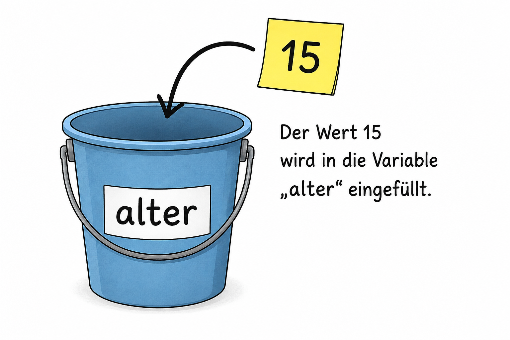
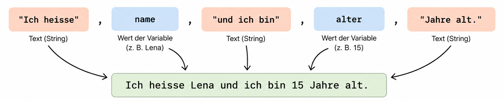

# Variablen und Datentypen

## Lernziele

Nach diesem Kapitel kannst du ...

-   erklären, was eine Variable ist und wozu sie verwendet wird.
-   Variablen Werte zuweisen und Wertänderungen nachvollziehen.
-   geeignete Variablennamen wählen.
-   die wichtigsten Datentypen in Python unterscheiden.
-   einfache Programme mit Variablen Schritt für Schritt nachvollziehen.

[📄 **Kapitel als PDF herunterladen**](assets/pdf/variablen-und-datentypen.pdf)

------------------------------------------------------------------------

## Was ist eine Variable?

Programme müssen häufig Daten speichern und später wieder verwenden. Dazu dienen **Variablen**.

Eine Variable kann man sich vereinfacht als einen benannten Speicherplatz vorstellen. Sie besitzt einen **Namen** und enthält einen **Wert**.

``` python
alter = 15
```

Die Variable `alter` enthält nun den Wert `15`.

Der gespeicherte Wert kann später über den Variablennamen verwendet werden:

``` python
print(alter)
```

Die Ausgabe lautet:

``` text
15
```

> 💡 **Merke:**
> Eine Variable ist ein benannter Speicherplatz für einen Wert. Über ihren Namen kann im Programm auf diesen Wert zugegriffen werden. [](assets/images/variable.png)

*Variable als Platzhalter für Werte*

------------------------------------------------------------------------

## Werte zuweisen

Mit dem Zeichen `=` wird einer Variable ein Wert **zugewiesen**:

``` python
x = 11
```

Eine solche Zuweisung besteht aus drei Teilen:

1.  dem Variablennamen `x`,
2.  dem Zuweisungsoperator `=`,
3.  dem Wert oder Ausdruck auf der rechten Seite.

Auch das Ergebnis einer Berechnung kann gespeichert werden:

``` python
x = (3 + 7) * 10 - 1
```

Python berechnet zuerst die rechte Seite. Anschliessend wird das Ergebnis `99` in `x` gespeichert.

------------------------------------------------------------------------

## Variablen können ihren Wert ändern

Der Wert einer Variable kann während eines Programms verändert werden.

``` python
x = 11
x = x + 4
```

Nach der ersten Zeile gilt `x → 11`. In der zweiten Zeile wird zuerst die rechte Seite ausgewertet: `x + 4 → 11 + 4 → 15`. Anschliessend wird der bisherige Wert von `x` durch `15` ersetzt.

> 💡 **Merke:**
> Bei einer Zuweisung wird immer zuerst die **rechte Seite berechnet**. Das Ergebnis wird danach in der Variable auf der **linken Seite gespeichert**.

### Unterschied zur Mathematik

Das Zeichen `=` hat beim Programmieren eine andere Bedeutung als in der Mathematik.

``` python
x = 10
```

bedeutet: **Speichere den Wert 10 in der Variable x.**

Deshalb ist auch Folgendes möglich:

``` python
x = 1
x = x + 1
```

Nach diesen beiden Anweisungen besitzt `x` den Wert `2`.

Dagegen ist `3 = x` in Python nicht möglich. Links vom Zuweisungsoperator muss eine Variable stehen, in der das Ergebnis gespeichert werden kann.

------------------------------------------------------------------------

## Mit mehreren Variablen arbeiten

Auf der rechten Seite einer Zuweisung können auch andere Variablen verwendet werden:

``` python
x = 10
y = x + 5
```

Danach gilt `x → 10` und `y → 15`.

Wird `x` anschliessend auf `20` gesetzt, ändert sich `y` nicht automatisch. `y` enthält weiterhin den zuvor berechneten Wert `15`.

------------------------------------------------------------------------

## Programme Schritt für Schritt verfolgen

Bei längeren Programmen ist es hilfreich, die Werte der Variablen nach jeder Anweisung aufzuschreiben.

``` python
a = 1
b = 0
b = a + b
b = b - a
b = a * 21
a = b / 7
```

  Anweisung          `a`     `b`
  -------------- ------- -------
  Start            undef   undef
  `a = 1`              1   undef
  `b = 0`              1       0
  `b = a + b`          1       1
  `b = b - a`          1       0
  `b = a * 21`         1      21
  `a = b / 7`        3.0      21

`undef` bedeutet, dass einer Variable noch kein Wert zugewiesen wurde.

> 💡 **Tipp:**\
> Wenn du ein Programm von Hand analysierst, führe die Anweisungen **von oben nach unten** aus und aktualisiere nach jeder Zuweisung deine Variablentabelle.

------------------------------------------------------------------------

## Variablen machen Programme flexibel

Variablen sind besonders nützlich, wenn ein Wert an mehreren Stellen im Programm verwendet wird.

``` python
seitenlaenge = 100

t.forward(seitenlaenge)
t.right(90)
t.forward(seitenlaenge)
```

Soll die Seitenlänge geändert werden, muss nur der Wert von `seitenlaenge` angepasst werden. Alle Befehle, die diese Variable verwenden, arbeiten danach mit dem neuen Wert.

------------------------------------------------------------------------

## Variablennamen

Gute Variablennamen helfen Menschen, ein Programm zu verstehen.

``` python
x = 100
```

ist weniger aussagekräftig als:

``` python
seitenlaenge = 100
```

Solche aussagekräftigen Namen nennt man **sprechende Variablennamen**.

### Regeln für Variablennamen

Variablennamen ...

-   müssen mit einem Buchstaben beginnen,
-   dürfen Buchstaben, Ziffern und `_` enthalten,
-   dürfen keine Leerzeichen enthalten,
-   werden in Python üblicherweise kleingeschrieben,
-   sollten möglichst beschreiben, was gespeichert wird.

Besteht ein Name aus mehreren Wörtern, werden diese mit einem Unterstrich verbunden:

``` python
anzahl_schueler = 24
seitenlaenge = 100
maximale_punktzahl = 50
```

> 💡 **Merke:**
> Gute Variablennamen machen ein Programm leichter lesbar und verständlich.

------------------------------------------------------------------------

## Datentypen

Variablen können unterschiedliche Arten von Daten speichern. Python unterscheidet diese mithilfe von **Datentypen**.

| Datentyp | Bedeutung | Beispiel |
|---|---|---|
| `int` | aus engl. integer: ganze Zahl | `42` |
| `float` | aus engl. floating point number: Kommazahl | `3.14` |
| `str` | aus engl. string: Text | `"Hallo"` oder `'Hallo'` |
| `bool` | steht für boolean (Wahrheitswert) | `True` oder `False` |

Der Datentyp bestimmt, wie Python einen Wert interpretiert und welche Operationen damit möglich sind.

### Ganze Zahlen -- `int`

Ganze Zahlen besitzen den Datentyp `int` (*integer*).

``` python
alter = 15
temperatur = -3
```

### Kommazahlen -- `float`

Zahlen mit Dezimalstellen besitzen den Datentyp `float`.

``` python
groesse = 1.72
temperatur = 21.5
```

> 💡 **Achtung:**
> Python verwendet bei Dezimalzahlen einen **Punkt** und kein Komma: `3.5` statt `3,5`.

### Texte -- `str`

Texte werden in Python als **Strings** (`str`) bezeichnet und in Anführungszeichen geschrieben.

``` python
name = "Bob"
text = "5"
```

Die Werte `5` und `"5"` sehen ähnlich aus, besitzen aber unterschiedliche Datentypen: `5` ist eine Zahl, `"5"` ist ein Text.

> 💡 **Merke:**
> Texte müssen in Python in Anführungszeichen stehen.

### Wahrheitswerte -- `bool`

Der Datentyp `bool` kennt nur zwei mögliche Werte:

``` python
True
False
```

Damit kann gespeichert werden, ob eine Aussage **wahr** oder **falsch** ist.

``` python
licht_an = True
spiel_beendet = False
```

Wahrheitswerte werden später insbesondere bei **Bedingungen** wichtig.

------------------------------------------------------------------------

### Der Datentyp ist entscheidend

Python verarbeitet Werte abhängig von ihrem Datentyp unterschiedlich.

``` python
zahl = 5
print(zahl * zahl)
```

Hier ist `zahl` eine ganze Zahl (`int`), mit der gerechnet werden kann. Dagegen ist `"5"` ein String. Nicht jede Rechenoperation, die mit Zahlen möglich ist, ist deshalb auch mit Texten sinnvoll oder erlaubt.

> 💡 **Merke:**
> Nicht nur der gespeicherte Wert ist wichtig, sondern auch sein **Datentyp**.

------------------------------------------------------------------------

## Kurzschreibweisen für Zuweisungen

Beim Programmieren werden Werte häufig verändert:

``` python
x = x + 1
```

Python bietet dafür die Kurzschreibweise:

``` python
x += 1
```

| Operation | Kurzschreibweise | entspricht |
|---|---|---|
| Addition | `x += 1` | `x = x + 1` |
| Subtraktion | `x -= 1` | `x = x - 1` |
| Multiplikation | `x *= 2` | `x = x * 2` |
| Division | `x /= 2` | `x = x / 2` |
| Ganzzahldivision | `x //= 2` | `x = x // 2` |
| Modulo | `x %= 2` | `x = x % 2` |

---

## Werte mit `print()` ausgeben

Mit der Funktion `print()` können Texte und Werte auf dem Bildschirm ausgegeben werden.

Ein Text wird dabei in Anführungszeichen geschrieben:

``` python
print("Hallo!")
```

Die Ausgabe lautet:

``` text
Hallo!
```

Auch der Wert einer Variablen kann ausgegeben werden:

``` python
alter = 15
print(alter)
```

Ausgabe:

``` text
15
```

### Texte und Variablen gemeinsam ausgeben

Häufig möchte man einen längeren Satz ausgeben, der sowohl festen Text als auch Werte von Variablen enthält. Dazu können in `print()` mehrere Teile **durch Kommas getrennt** angegeben werden.

``` python
name = "Lena"
alter = 15

print("Ich heisse", name, "und ich bin", alter, "Jahre alt.")
```

Die Ausgabe lautet:

``` text
Ich heisse Lena und ich bin 15 Jahre alt.
```

Python setzt zwischen den einzelnen, durch Kommas getrennten Teilen automatisch ein Leerzeichen. Dabei können auch unterschiedliche Datentypen gemeinsam ausgegeben werden. Im Beispiel ist `name` ein `str` und `alter` ein `int`.

> 💡 **Merke:**
> Mit `print()` können mehrere Texte und Variablen gemeinsam ausgegeben werden.
> Die einzelnen Teile werden durch **Kommas** getrennt. Python fügt bei der Ausgabe automatisch Leerzeichen dazwischen ein.
>
> `print("Text", variable, "weiterer Text")`

[](assets/images/print_beispiel.png)

*print-Ausgabe von mehreren Werten*

---------------------------------------------------------------

## Werte mit `input()` einlesen

Bisher haben wir Werte direkt im Programm gespeichert:

``` python
alter = 15
```

Oft soll ein Wert aber erst während der Ausführung des Programms eingegeben werden. Dafür gibt es die Funktion `input()`.

``` python
name = input("Wie heisst du? ")
print("Hallo", name)
```

Beim Ausführen des Programms erscheint die Frage:

``` text
Wie heisst du?
```

Die Eingabe wird anschliessend in der Variablen `name` gespeichert.

### `input()` liefert immer einen Text

Eine Eingabe mit `input()` hat zunächst **immer den Datentyp `str`**, auch wenn eine Zahl eingegeben wird.

``` python
alter = input("Wie alt bist du? ")
print(type(alter))
```

Gibt man beispielsweise `15` ein, ist `alter` trotzdem ein `str` und keine Zahl. Der Befehl `type()` gibt den Datentyp einer Variablen zurück.

> 💡 **Merke:**
> Die Funktion `input()` liefert immer einen Wert vom Datentyp **`str`**.
> Soll mit der Eingabe gerechnet werden, muss sie zuerst in den passenden Datentyp umgewandelt werden.

## Datentypen umwandeln -- Typecasting

Das Umwandeln eines Wertes von einem Datentyp in einen anderen nennt man **Typecasting**.

Dafür können beispielsweise `int()`, `float()` und `str()` verwendet werden.

| Funktion | Umwandlung | Beispiel |
|---|---|---|
| `int()` | in eine ganze Zahl | `int("15")` → `15` |
| `float()` | in eine Dezimalzahl | `float("3.5")` → `3.5` |
| `str()` | in einen Text | `str(15)` → `"15"` |

### Ganze Zahlen einlesen

Soll eine ganze Zahl eingegeben werden, kann `input()` direkt mit `int()` kombiniert werden:

``` python
alter = int(input("Wie alt bist du? "))
```

Der Ablauf ist dabei:

1.  `input()` liest die Eingabe als `str` ein.
2.  `int()` wandelt den Text in eine ganze Zahl um.
3.  Die Zahl wird in `alter` gespeichert.

Nun kann damit gerechnet werden:

``` python
alter = int(input("Wie alt bist du? "))
naechstes_alter = alter + 1

print("Nächstes Jahr bist du", naechstes_alter, "Jahre alt.")
```

### Dezimalzahlen einlesen

Für Zahlen mit Nachkommastellen wird `float()` verwendet:

``` python
groesse = float(input("Wie gross bist du in Metern? "))
```

Eine Eingabe wie `1.72` wird dadurch als `float` gespeichert.

> ⚠️ **Achtung: Dezimalzahlen in Python**
> Dezimalzahlen werden in Python mit einem **Punkt** geschrieben: `1.72`.
> Eine Eingabe mit Komma wie `1,72` kann nicht direkt mit `float()` umgewandelt werden.

### Texte einlesen

Bei Texten ist keine Umwandlung notwendig:

``` python
name = input("Wie heisst du? ")
```

`name` ist automatisch vom Datentyp `str`.

Man könnte zwar auch schreiben:

``` python
name = str(input("Wie heisst du? "))
```

Das ist aber unnötig, da `input()` bereits einen `str` liefert.

> 💡 **Merke:**  
> Welche Umwandlung benötigt wird, hängt davon ab, was mit der Eingabe gemacht werden soll:
>
> `name = input("Name: ")` → `str`  
> `alter = int(input("Alter: "))` → `int`  
> `groesse = float(input("Grösse: "))` → `float`

# Denkaufgaben

## Aufgabe 1 -- Variablen verfolgen

Bestimme nach jeder Anweisung die Werte von `x` und `y`.

``` python
x = 5
y = x + 3
x = 10
y = y + x
x = x - 4
```

  Anweisung         `x`     `y`
  ------------- ------- -------
  Start           undef   undef
  `x = 5`               
  `y = x + 3`           
  `x = 10`              
  `y = y + x`           
  `x = x - 4`           

## Aufgabe 2 -- Datentypen erkennen

Bestimme jeweils den Datentyp.

``` python
alter = 15
name = "Anna"
temperatur = 21.5
angemeldet = True
postleitzahl = "8610"
```

Warum könnte es sinnvoll sein, eine Postleitzahl als Text und nicht als Zahl zu speichern?

## Aufgabe 3 -- Was wird ausgegeben?

Bestimme die Ausgabe, ohne das Programm auszuführen.

``` python
x = 10
print(x)

x = x + 5
print(x)

y = x * 2
print(y)
```

## Aufgabe 4 -- Gute Variablennamen

Welche Variablennamen sind für ein Programm besser geeignet? Begründe deine Entscheidung.

``` text
x                  oder    seitenlaenge
n                  oder    anzahl_schueler
t                  oder    temperatur
a                  oder    alter
```

Gibt es Situationen, in denen ein kurzer Variablenname trotzdem sinnvoll sein kann?

## Aufgabe 5 -- Fehler finden

Welche der folgenden Zuweisungen sind problematisch oder ungültig? Begründe.

``` python
alter = 15
vorname = "Mia"
2zahl = 10
meine zahl = 7
temperatur = 21.5
3 = x
```

------------------------------------------------------------------------

## Aufgabe 6 -- Datentypen bestimmen

Welchen Datentyp haben die Variablen nach diesen Anweisungen?

``` python
a = input("Eingabe: ")
b = int(input("Eingabe: "))
c = float(input("Eingabe: "))
```

## Aufgabe 7 -- Fehler bestimmen

Erkläre, weshalb folgendes Programm nicht wie erwartet funktioniert:

``` python
alter = input("Wie alt bist du? ")
naechstes_alter = alter + 1
```

## Aufgabe 8 -- Code ergänzen

Ergänze das Programm so, dass zwei ganze Zahlen eingelesen und anschliessend addiert werden:

``` python
zahl1 = ...
zahl2 = ...

summe = zahl1 + zahl2
print("Summe:", summe)
```

------------------------------------------------------------------------

# Zusammenfassung

> 💡 **Merke**
>
> -   Eine **Variable** ist ein benannter Speicherplatz für einen Wert.
> -   Mit `=` wird einer Variable ein Wert **zugewiesen**.
> -   Bei einer Zuweisung wird zuerst die rechte Seite ausgewertet und danach das Ergebnis gespeichert.
> -   Variablen können ihren Wert während eines Programms verändern.
> -   **Sprechende Variablennamen** machen Programme verständlicher.
> -   Werte besitzen unterschiedliche **Datentypen**, beispielsweise `int`, `float`, `str` und `bool`.
> -   Der Datentyp bestimmt, wie Python einen Wert interpretiert und verarbeitet.

------------------------------------------------------------------------

# Programmieraufgaben

Unter folgendem Link sind die Programmieraufgaben in CodeExpert zu finden:

[Variablen-Basic](https://cxedu.ethz.ch/print/sfkwicx3/AS26/peiS4gqmfNnbFNRqt)\
[Variablen_Advanced](https://cxedu.ethz.ch/print/sfkwicx3/AS26/t4pLKbhkJxQTojFGq)
